# Self-Driving Car Engineer Nanodegree

## Project: **Traffic Sign Classifier** 
***
This is a ML based traffic sign classification implementation using a variety of CNN network architectures with keras framework. 

The project implementation is structured as follows. 

---
>**Traffic Sign Classification Project**
>1. Data Process
>    1. Data is analyzed to highlight low-frequency categories and suitably augmented. 
>    2. The augmented data is then normalized before pickling.
>2. ML Classifiers
>    1. Three differnt architectures are used to compare classifier performance. The 3 netowrk architectures chosen are LeNet, AlexNext and GoogLeNet. 
***

## 1. Data Processor

**Test data source & references**

1. Data-set from GTSRB web-site as per project requirements -- [German Traffic Sign Repo](benchmark.ini.rub.de/?section=gtsrb&subsection=dataset#Imageformat)

2. Network model examples were derived from github repos, especially the variant of AlexNet to fit the data-set constraints -- [liferlisiqi GitHub](https://github.com/liferlisiqi/Traffic-Sign-Classifier/blob/master/README.md) 

This program reads from data-source and performs bsic data analysis and summarization. It then normlaizes the data and chaches the normalized data sets into a pickle file for further network processing. 

>**Note**: Data normalization is applied to the given data-set as well as the downloaded German Traffic Sign data-base. See sections towards the end of this notebook for the GTSRB data-processing. 

Sample training data set visualization: 
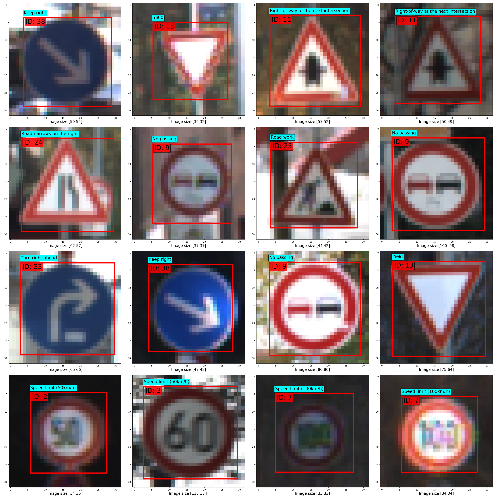

- - - - 

### 1.1 Data Augmentation
Using data-augmentation to enlarge training set for a more generalized & robust network. 

Simple augmentation techniques are employed here which include
 
 1. Small random image dithers: samples randomly perturbed in 
     - Position ([-2,2] pixels)
     - Scale ([.9,1.1] ratio) and 
     - Rotation ([-15,+15] degrees)
     
Random selections of images with equal sampling from each traffic sign class ID are done with 1/3rd of the samples being applied with the dithers above. 

A simpler technique is to shuffle the selected training set and select each 1/3rd partition to apply the dithering. This is used to simplify the data augmentation process.

>**Note**: For augmentation, only a 1/3 of the entire training set is chosen, so essentially each of the 3 augmentations are applied to only 1/9th of the original image training set. This is done primarily as a method to save on the disk-space as the combined data set now only consumes x1.33 of the original space.  

>**Note**: The training image size & sign RoI locations are not modified after augmentation and replicated in the augmented training set as-is. The argument for this is that simply the dithered/scaled/rotated images are warped/scaled back to original size and hence the RoI ofr the labelled traffic sign should not vary by much, if at all. 

>**Note**: To make the training data-set more unifor,m across categories, augmentation is performed on original training-set with frequency of traffic-sign category `< 0.015`.  

Following is a plot of the training data set after & before augmentation showing a **more  uniform** distribution of categories. 
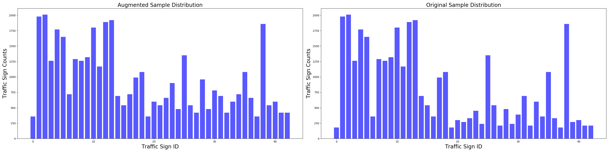

### 1.2 Data-set Summary
This section povides a brief statistical analysis of the data-set, both before and afetr augmenation is applied. 
From the provided data-set, the analysis results in the following stats: 

---
`Unique labels =  43
Training set: 
	 Number of samples =  34799 :(67.13%)
	 Image dimension   =  32 x 32 x 3
	 Data types (X, y) =  uint8 , uint8
	 Data range (X, y) =  255 , 42
Validation set: 
	 Number of samples =  4410 :(8.51%)
	 Image dimension   =  32 x 32 x 3
	 Data types (X, y) =  uint8 , uint8
	 Data range (X, y) =  255 , 42
Test set: 
	 Number of samples =  12630 :(24.36%)
	 Image dimension   =  32 x 32 x 3
	 Data types (X, y) =  uint8 , uint8
	 Data range (X, y) =  255 , 42`
    
---
The pickled data is a dictionary with 4 key/value pairs:

- `'features'` is a 4D array containing raw pixel data of the traffic sign images, (num examples, width, height, channels).
- `'labels'` is a 1D array containing the label/class id of the traffic sign. The file `signnames.csv` contains id -> name mappings for each id.
- `'sizes'` is a list containing tuples, (width, height) representing the original width and height the image.
- `'coords'` is a list containing tuples, (x1, y1, x2, y2) representing coordinates of a bounding box around the sign in the image. 

> **Note**: These co-ordinates assume the original image resolution. The pickled data contains resized versions (32 x 32) of the images.

Data summary includes resolution and range information for each of the `training`, `validation` and `test` data-sets along with a relative distribution of the images into the various traffic-sign labels. 
The three data-set categories have the followign distribution from the `43` categories of traffic signs. 

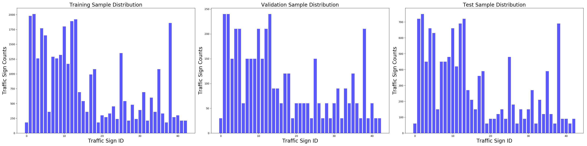

### 1.3 Data-set Summary
**Data Normalization**
Get all data (`train`, `validation` and `test`) data to zero-mean and unit variance. As our image data-set is image based, we have provided 2 modes to normalize the set. After normaliztion, data should lie approximately within range `[-1, 1]`.

 1. **`simple`** : normalize the 8bit images using the `x = 2*x/range(x) - 1`
 2. **`minmax`** : normalize using the range of the images 
 3. **`meandev`** : normalize using the set mean and std-deviation (takes a little bit more time)

No appreciable performance boost has been observed with the more involved normalization and hence the `simple` mode is preferred. 

A trial was performed using grayscale images to evaluate classifier performance especially for low-light images. No benefit was seen and grayscale normalized ouputs are only provided to keep the pickled data-set availabe for any further investigations.  

Sample data-set (normalized):
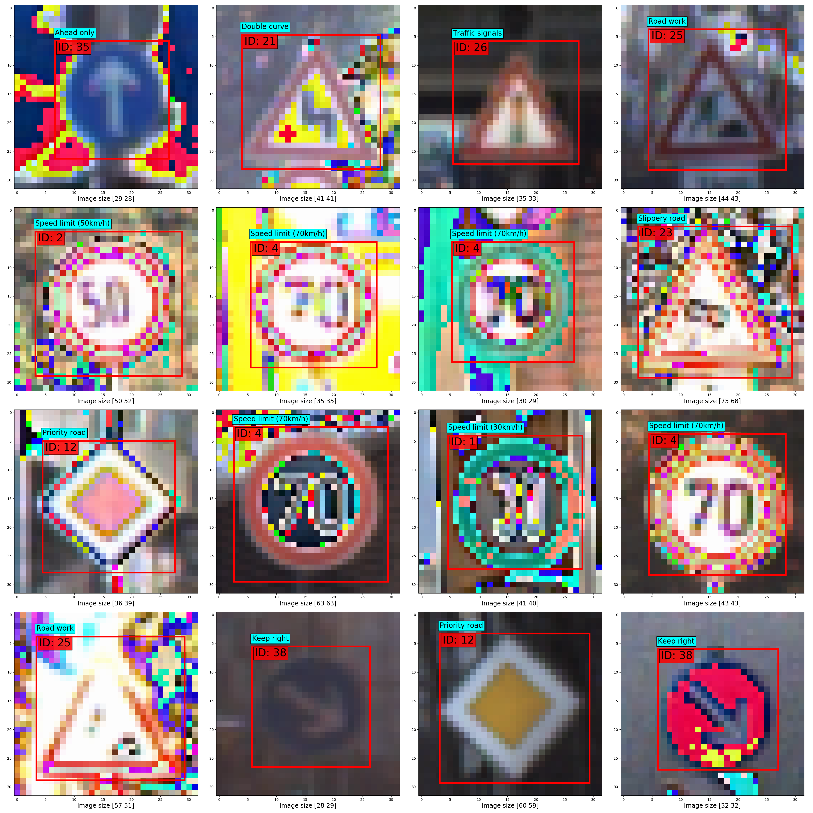

### 1.4 German Traffic Sign DB  
This data-set is used as a test data-set and is held separate from the data shown above that is purely used for model evaluation, performance avalidation and accuracy testing. 

**Using Test Image Data-set**
[Test Images](http://benchmark.ini.rub.de/?section=gtsrb&subsection=dataset#Downloads)

**Process Test Images**
  1. Read annotations from csv file
  2. Resize images to 32x32x3 RGB format in 8bit color
  3. Normalize and cache in a pickle file

## 2. CNN Classifiers

After data-augmentation & normalization, 3 different architectures of CNN classifiers are evaluated for performance comparisons fo rtraffic-sign classification. 

### 2.1 LeNet 
This program reads pre-processed data from pickled data-source and applies the LeNet model for traffic sign classification.
The TensorFlow model is then pickled in the `./models` sub-directory for the final evaluation phase.  

>**Strategy**: 
> 1. Training hyper-parameters were selected afetr a fair amount  of parameter sweeps but essentially are empirircal in the choice. The set values in this notebook perform with goo accuracy for the particular data-sets chosen for validation & testing. 
> 2. A drop-out scheme was chosen as a simpler mechanism to reduce weight variance rahter than L2-regularization or other more elaborate methods. 
> 3. An early training termination crietria was chosen to be when per-epoch training accuracy (measured on validation set) was found to decrease by $\le \epsilon=10^{-3}$. This was done primarily to shorten training wall-clock times for a model with *sufficient* accuracy for the particular classifier task.  
> 4. Note that the early termination kicks in only after _a minimum number of epochs_ (chosen here to be $E = 15$) have been run. 

#### 2.1.1 LeNet Model Architecture

Design and implement a deep learning model that learns to recognize traffic signs. Train and test your model on the [German Traffic Sign Dataset](http://benchmark.ini.rub.de/?section=gtsrb&subsection=dataset).

The LeNet-5 implementation shown in the [classroom](https://classroom.udacity.com/nanodegrees/nd013/parts/fbf77062-5703-404e-b60c-95b78b2f3f9e/modules/6df7ae49-c61c-4bb2-a23e-6527e69209ec/lessons/601ae704-1035-4287-8b11-e2c2716217ad/concepts/d4aca031-508f-4e0b-b493-e7b706120f81) at the end of the CNN lesson is a solid starting point. You'll have to change the number of classes and possibly the preprocessing, but aside from that it's plug and play! 

With the LeNet-5 solution from the lecture, you should expect a validation set accuracy of about 0.89. To meet specifications, the validation set accuracy will need to be at least 0.93. It is possible to get an even higher accuracy, but 0.93 is the minimum for a successful project submission. 

There are various aspects to consider when thinking about this problem:

- Neural network architecture (is the network over or underfitting?)
- Play around preprocessing techniques (normalization, rgb to grayscale, etc)
- Number of examples per label (some have more than others).
- Generate fake data.

Here is an example of a [published baseline model on this problem](http://yann.lecun.com/exdb/publis/pdf/sermanet-ijcnn-11.pdf). It's not required to be familiar with the approach used in the paper but, it's good practice to try to read papers like these.

>**Note**: No padding is required for this implementation as the normalized data-set has be re-sized to 32 x 32.

>**Note**: RGB images are used here, set `USE_GRAYSCALE = True` to use gray-scaled versions. 

#### 2.1.2 TensorFlow Environment Hyper-Parameters

Re-shuffle data-set to remove hidden biases in labelled sequences

**Hyperparameter Record** 

>`USE_GRAYSCALE = False`
>`EPOCHS = 50`
>`BATCH_SIZE = 128`
>`KEEP_PROB = .85`
>`LEARN_RATE = 1e-3`
>`USE_SGD = 'Adam'` 

#### 2.1.3 LeNet5 Network

**Model Layer Architecture**

Input data is a normalized RGB frame of size `32x32` pixels. The LeNet network base-layers can be used almost without modification. The only change of course is to modify the final fully-connected layer to detect `n_classes` number of categories in stead of teh standard 10 categories from LeNet's original implementation.  

As implemented, the network below has the following layer organization: (derived from a Keras summary implementation of the network) 

#### 2.1.4 Model Performance on Test Images

Apply the validted model on the test set and predict traffic-sizn class ID. Analyze performance to meet minimum accuracy of `> 95%`. 

There are two test modes, using pickled test data & using traffic sign images from the German traffic sign data-base. 
Obtain the top-5 detected class IDs along with the detection prbabilities (`softmax` values).

**LeNet Test Accuracy**
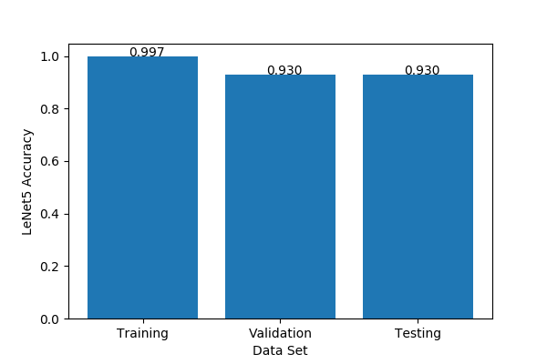

**LeNet Top-5 Probability Performance**
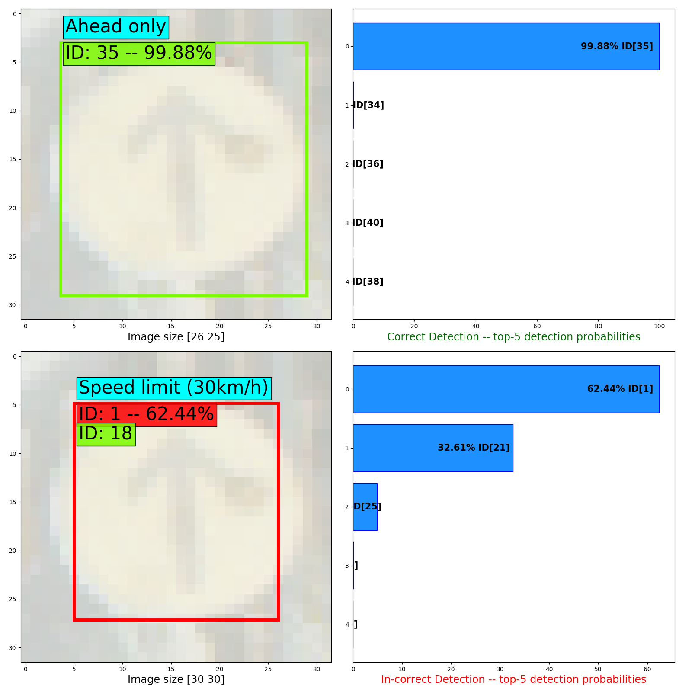

**GTSRB Test Evaluation**
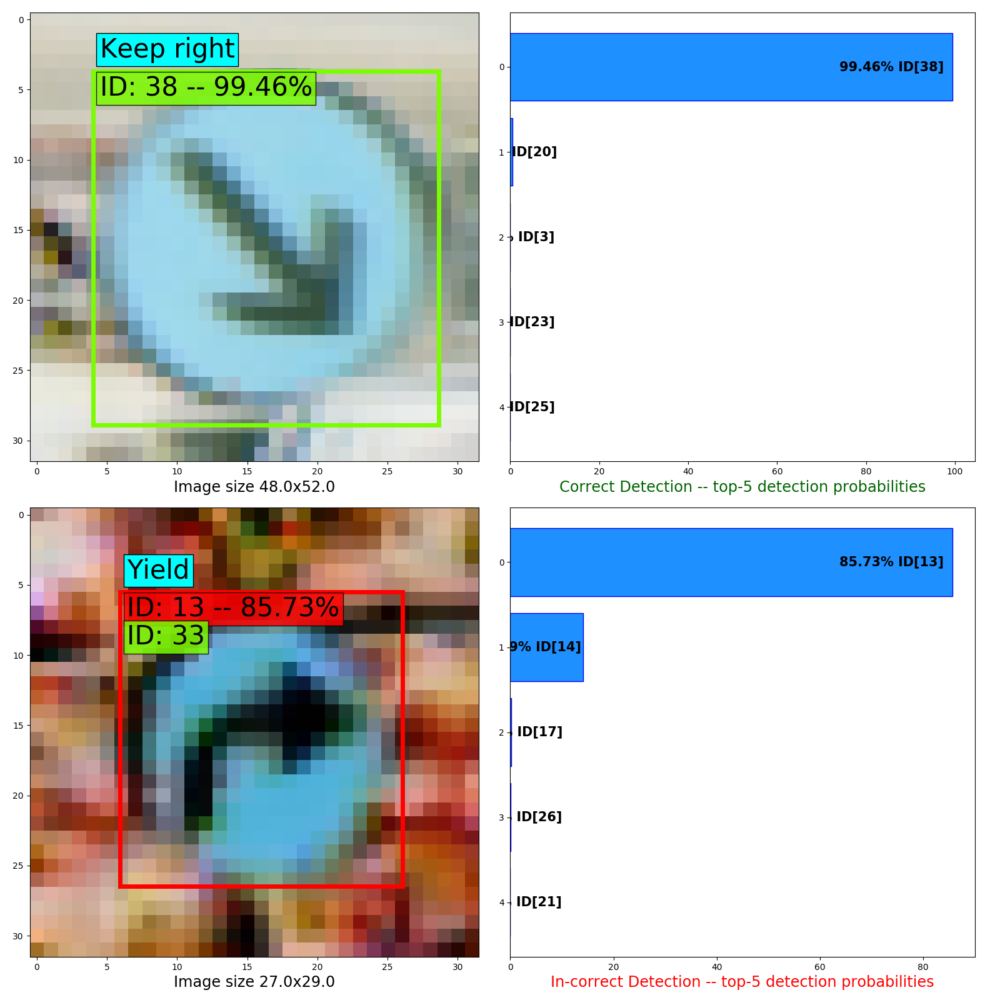

#### 2.1.5 LeNet Activation Visualization
A sample test image is passed through the 2nd layer of the LeNet arhitecture and the convolution activations are observed as below: 
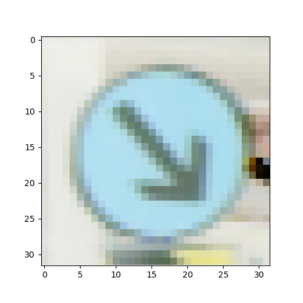
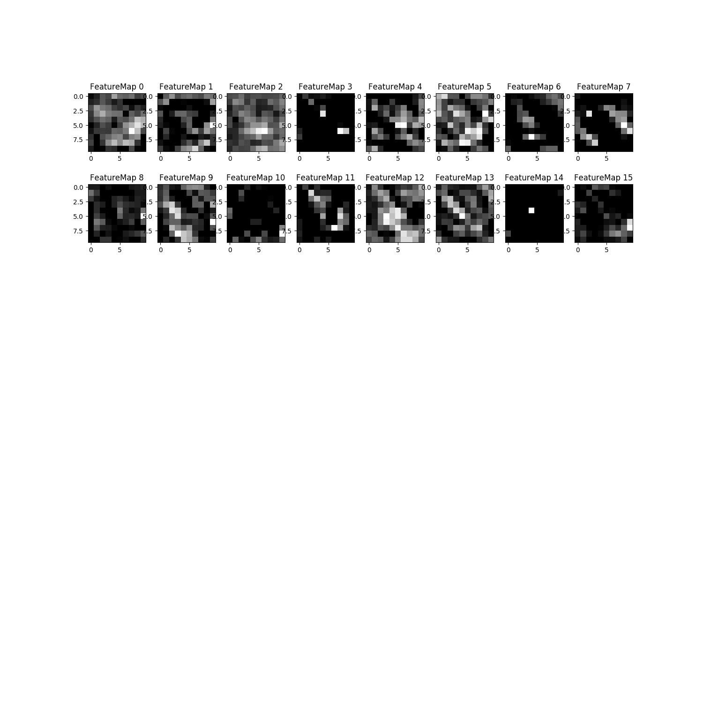

### 2.2 AlexNet

This program reads pre-processed data from pickled data-source and applies the GoogLeNet Inceptionv3 model for traffic sign classification.
The TensorFlow model is then pickled in the `./models` sub-directory for the final evaluation phase.  

>**Strategy**: 
> 1. Training hyper-parameters were selected after a fair amount  of parameter sweeps but essentially are empirircal in the choice. The set values in this notebook perform with goo accuracy for the particular data-sets chosen for validation & testing. 
> 2. A L2 regularization scheme is chosen as in the standard AlexNet arhcitecture. 
> 3. An early training termination crietria was chosen to be when per-epoch training accuracy (measured on validation set) was found to decrease by $\le \epsilon=10^{-3}$. This was done primarily to shorten training wall-clock times for a model with *sufficient* accuracy for the particular classifier task.  
> 4. Note that the early termination kicks in only after _a minimum number of epochs_ (chosen here to be $E = 15$) have been run. 

#### 2.2.1 AlexNet Model Architecture

Design and implement a deep learning model that learns to recognize traffic signs. Train and test your model on the [German Traffic Sign Dataset](http://benchmark.ini.rub.de/?section=gtsrb&subsection=dataset).

There are various aspects to consider when thinking about this problem:

- Neural network architecture (is the network over or underfitting?)
- Play around preprocessing techniques (normalization, rgb to grayscale, etc)
- Number of examples per label (some have more than others).
- Generate fake data.

>**Note**: No padding is required for this implementation as the normalized data-set has be re-sized to 32 x 32.

>**Note**: RGB images are used here, set `USE_GRAYSCALE = True` to use gray-scaled versions. 

#### 2.2.2 TensorFlow Environment Hyper-Parameters

Re-shuffle data-set to remove hidden biases in labelled sequences

**Hyperparameter Record** 

> *AlexNet*: `USE_GRAYSCALE = False`, `EPOCHS = 30`, `BATCH_SIZE = 128`, `KEEP_PROB = .5`, `LEARN_RATE = 5e-4`, `USE_SGD = 'Adam'`, `BETA=1e-5` 

#### 2.2.3 AlexNet Network

---
**Model Layer Architecture**

Input data is a normalized RGB frame of size `32x32` pixels. The AlexNet network base-layers can be used almost without modifications. The changes required are for the  final fully-connected layer to detect `n_classes` number of categories as well as some modifications to suit the in stead of teh standard 10 categories from LeNet's original implementation.  

As implemented, the network below has the following layer organization: (derived from a Keras summary implementation of the network) 

#### 2.2.3 Train & Validate the Model

Run the training data through the training pipeline to train the model.

Before each epoch, shuffle the training set.

After each epoch, measure the loss and accuracy of the validation set.

A validation set can be used to assess how well the model is performing. A low accuracy on the training and validation
sets imply underfitting. A high accuracy on the training set but low accuracy on the validation set implies overfitting.

Save the model after training.

AlexNet Accuracy Curve: 
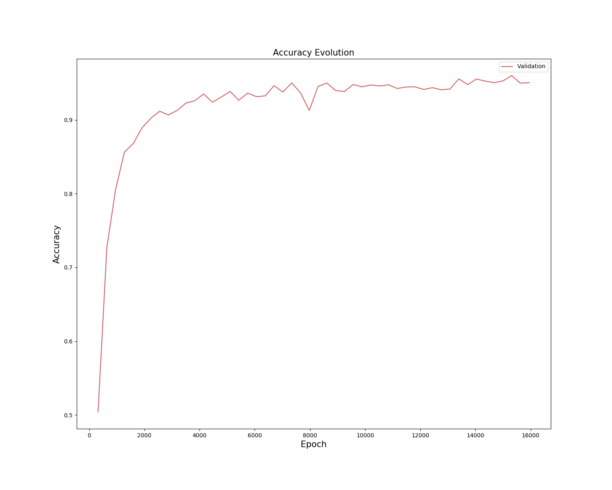

#### 2.2.4 Model Performance on Test Images

Apply the validted model on the test set and predict traffic-sizn class ID. Analyze performance to meet minimum accuracy of `> 95%`. 

There are two test modes, using pickled test data & using traffic sign images from the German traffic sign data-base. 
Obtain the top-5 detected class IDs along with the detection prbabilities (`softmax` values).

AlexNet Test Accuracy Comparison: 
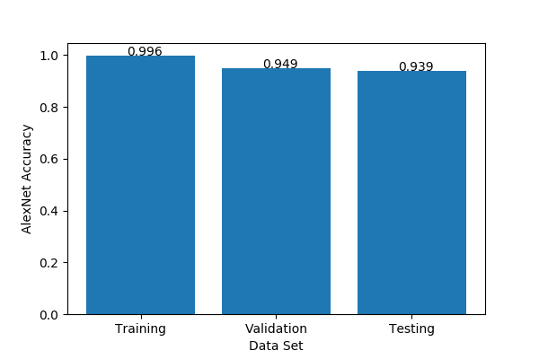

AlexNet Sample Test Output: 
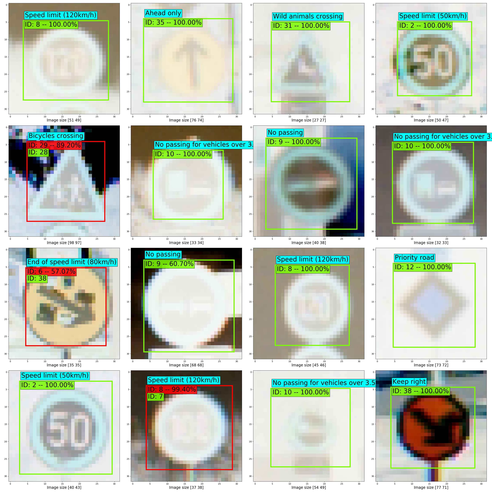

AlexNet Top-5 Detection Probabilities:
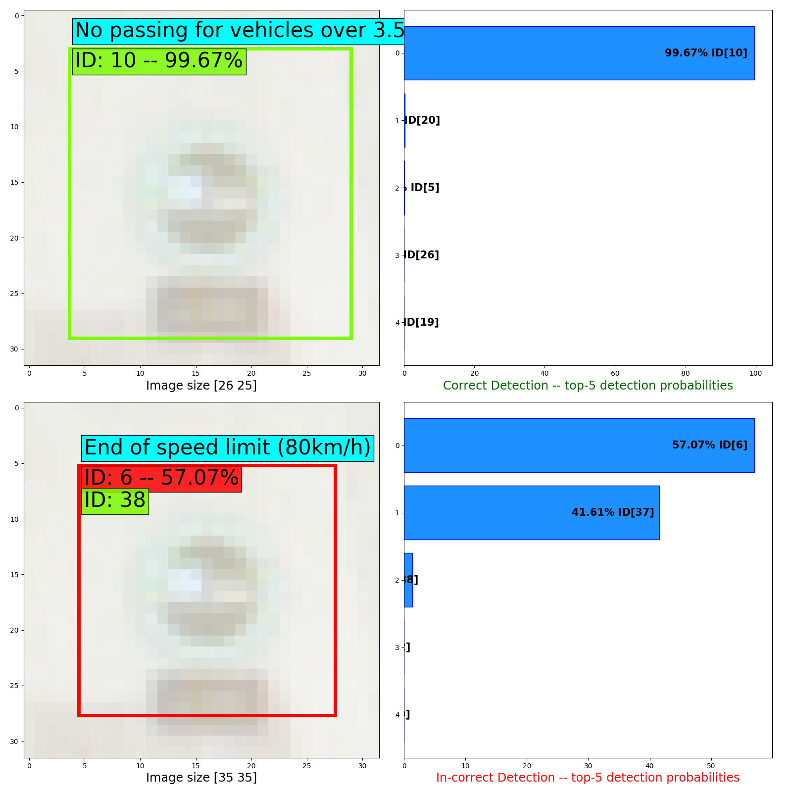

GTSRB Classification Results: 
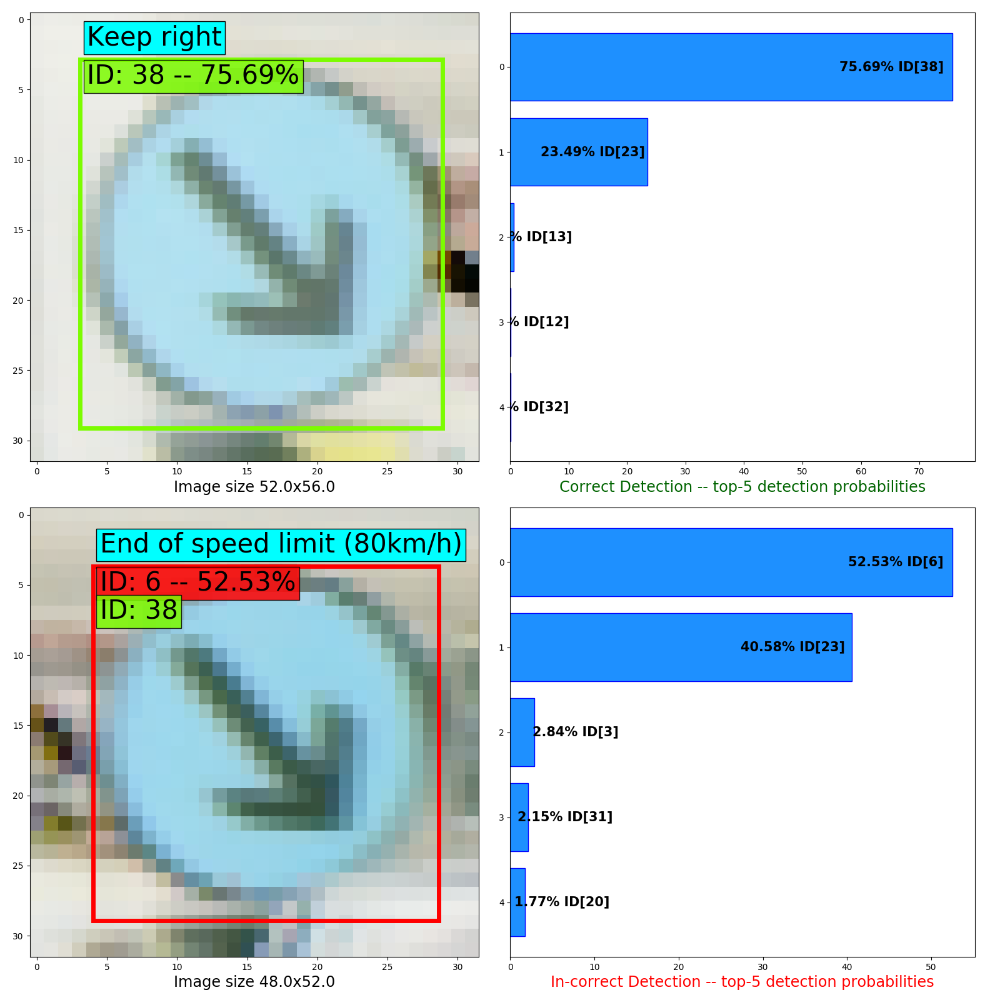

#### 2.2.5 AlexNet Activation Visualization
A sample test image is passed through the 1st layer of the AlexNet arhitecture and the convolution activations are observed as below: 

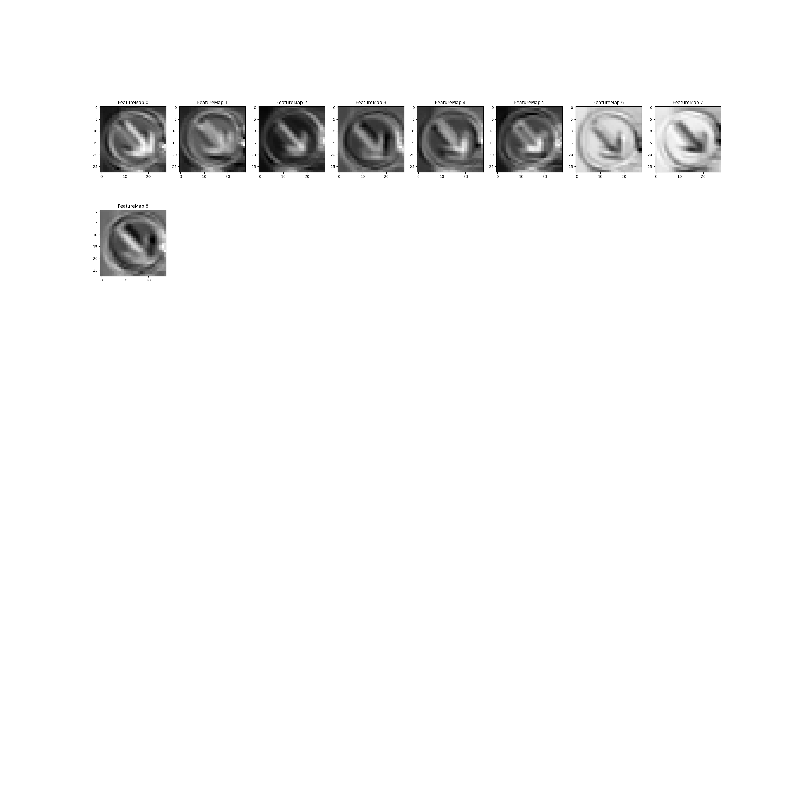

### 2.3 GoogLeNet
This program reads pre-processed data from pickled data-source and applies the GoogLeNet Inceptionv3 model for traffic sign classification.
The TensorFlow model is then pickled in the `./models` sub-directory for the final evaluation phase.  

>**Strategy**: 
> 1. Training hyper-parameters were selected afetr a fair amount  of parameter sweeps but essentially are empirircal in the choice. The set values in this notebook perform with goo accuracy for the particular data-sets chosen for validation & testing. 
> 2. A drop-out regularization scheme is chosen as in the stndard Inceptionv3-based Googlenet arhcitecture. 
> 3. An early training termination crietria was chosen to be when per-epoch training accuracy (measured on validation set) was found to decrease by $\le \epsilon=10^{-3}$. This was done primarily to shorten training wall-clock times for a model with *sufficient* accuracy for the particular classifier task.  
> 4. Note that the early termination kicks in only after _a minimum number of epochs_ (chosen here to be $E = 15$) have been run. 

#### 2.3.1 GoogLeNet Model Architecture

Design and implement a deep learning model that learns to recognize traffic signs. Train and test your model on the [German Traffic Sign Dataset](http://benchmark.ini.rub.de/?section=gtsrb&subsection=dataset).

There are various aspects to consider when thinking about this problem:

- Neural network architecture (is the network over or underfitting?)
- Play around preprocessing techniques (normalization, rgb to grayscale, etc)
- Number of examples per label (some have more than others).
- Generate fake data.

>**Note**: No padding is required for this implementation as the normalized data-set has be re-sized to 32 x 32.

>**Note**: RGB images are used here, set `USE_GRAYSCALE = True` to use gray-scaled versions. 

#### 2.3.2 TensorFlow Environment Hyper-Parameters

Re-shuffle data-set to remove hidden biases in labelled sequences

**Hyperparameter Record** 

> *GoogLeNet*: `USE_GRAYSCALE = False`, `EPOCHS = 35`, `BATCH_SIZE = 128`, `KEEP_PROB = .5`, `LEARN_RATE = 4e-4`, `USE_SGD = 'Adam'` 

#### 2.3.3 GoogLeNet Network (& Inception v3 Model)

----

**Model Layer Architecture**

Input data is a normalized RGB frame of size `32x32` pixels. The Inception v3 based GoogLeNet network base-layers can be used almost without modifications. The changes required are for the  final fully-connected layer to detect `n_classes` number of categories as well as some modifications to suit the in stead of the standard 10 categories from original implementation original implementation.  

As implemented, the network below has the following layer organization: (derived from a Keras summary implementation of the network)  
>**Note**:
The following code has been used from the Keras documentation directly
[Keras Application Inception v3](https://keras.io/applications/#inceptionv3)

GoogLeNet Learning Curve: 

GoogLeNet Accuracy Curve: 

#### 2.3.4 Model Performance on Test Images

Apply the validated model on the test set and predict traffic-sizn class ID. Analyze performance to meet minimum accuracy of `> 95%`. 

There are two test modes, using pickled test data & using traffic sign images from the German traffic sign data-base. 
Obtain the top-5 detected class IDs along with the detection prbabilities (`softmax` values).

GoogLeNet Test Accuracy: 

GoogLeNet Top-5 Probability Performance: 

GTSRB Test Evaluation:

---

## 3. Discussion

A few enhancements that can make the implementation more robust:

    1. Data-augmentation to account for poor lighting conditions may improve outlier performance for some hazy traffic sign images. 
    
